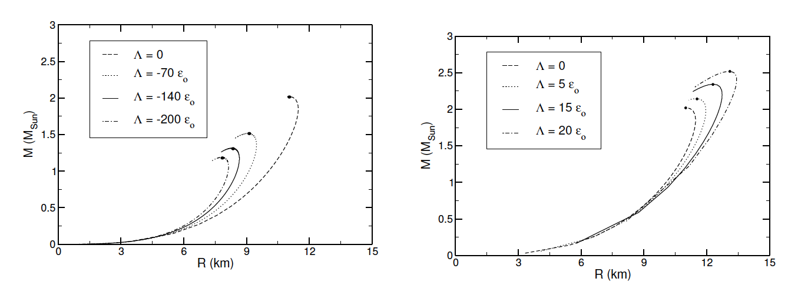
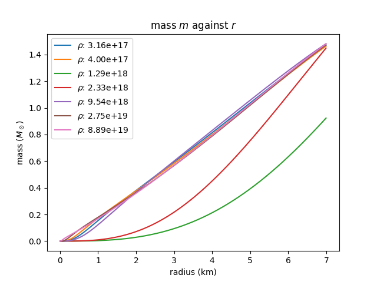
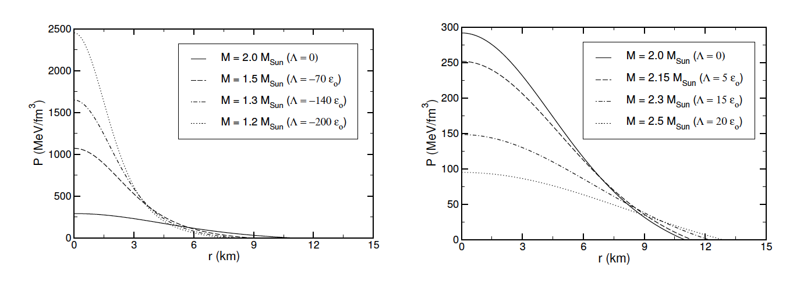
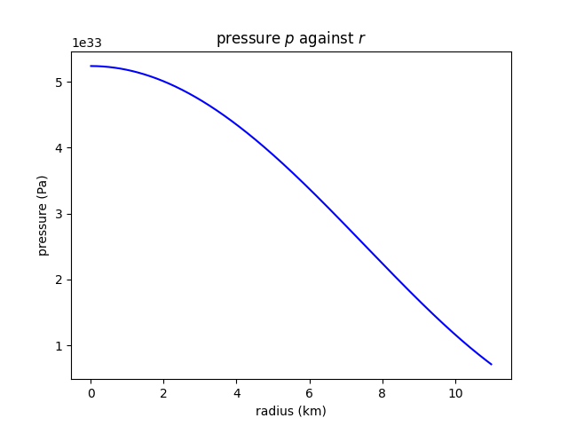

# Solving Tolman-Oppenheimer-Volkoff (TOV) equation using RK4 
This code is written in Python3 to perform numerical integration to having solutions to the TOV equations.

## Prerequisites
* numpy
* maplotlib
* scipy
It is recommended that a virtual python environment is available while running the code.
```
conda create -n tov python==3.8
conda activate tov
pip install scipy numpy matplotlib
```

## Running the code
Use the following command line to run
```
python3 main.py
```

## Results
This code regenerate results from (Zubairi, 2015)

Our ouput

<div align="center">
!</div>

Where the pressure against radius also matches with the shape from the literature



<div align="center">
!</div>